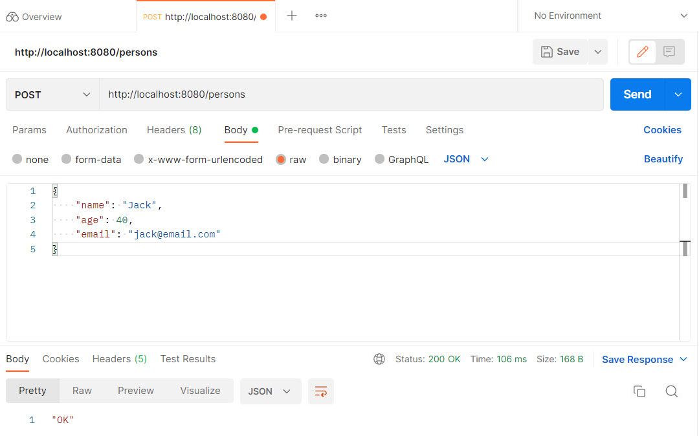

## rest-application

### Realization of RESTful API using Spring Boot Technology

***Description:***

This application demonstrates the architectural style of building software 
for distributed systems such as REST (Representational State Transfer).
There are registered users in the database, which can be accessed through appropriate HTTP queries.  
An additional client-server interaction program such as POSTMAN is required to test this REST API correctly.  
Using a GET request to http://localhost:8080/persons, you will get a list of users in JSON format.  
You can also request one user by ID at http://localhost:8080/persons/1 (1 is user ID).  
Please note that if you enter a non-existent id, then in response you will receive a JSON object with an error,  
which was previously provided and written in the program code as an exception.  
In addition to receiving data from the server with a GET request,  
you can also send data to the server with a POST request.  
In this case, register a new user in the database.  
The request is made at http://localhost:8080/persons BUT in the POST form.  
Prepare the request body in JSON format, for example:  
> {  
"name": "Jack",  
"age": 40,  
"email": "jack@email.com"  
}  
>

***How to use:***

Create a new local "database" schema (I used MySQL), and add your username and password to the application.properties file.  
Create the "RestApplication" class run configuration in your IDE and start the REST Application.

***Tools used:***

Java  
Maven  
Spring Boot  
Model Mapper  
MySQL  
FlyWay  
